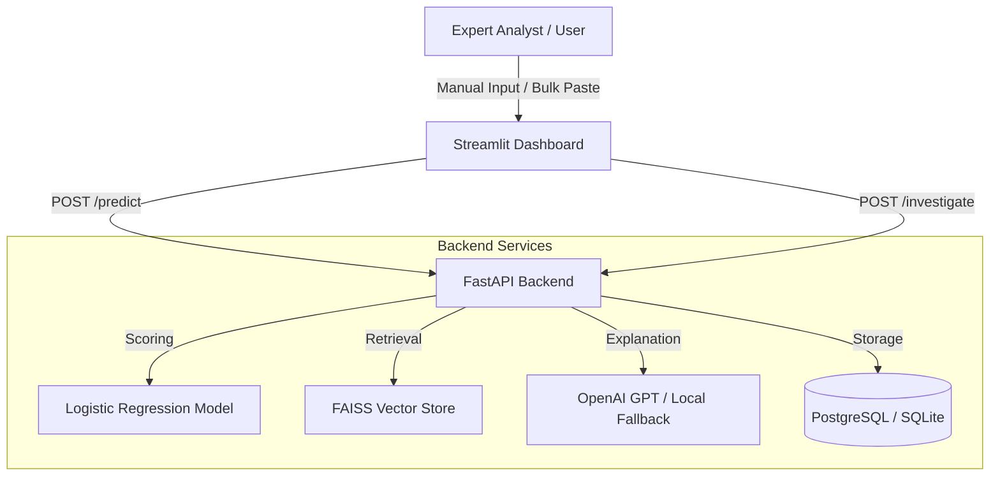

# 🛡️ AI-Powered Credit Card Fraud Detection & Investigation Platform

A production-grade, full-stack fraud detection system combining **Logistic Regression**, a **RAG (Retrieval-Augmented Generation) pipeline**, **FastAPI**, and a **Streamlit** Expert Dashboard.

---

## ✨ Key Features

- **🚀 Dual-Engine Inference**:
  - **Predict (Fast)**: Immediate ML-based probability score.
  - **Investigate (Deep)**: RAG-powered AI report explaining *why* a transaction is risky.
- **🔬 Expert Dashboard**:
  - **30-Feature Support**: Full control over all PCA features (V1-V28), Time, and Amount.
  - **Bulk Paste Parser**: Paste raw CSV lines directly into the UI for instant analysis.
  - **State-of-the-Art Precision**: Handles 6+ decimal places for high-accuracy ML scoring.
- **🛡️ Intelligent Fallback**: Automatically switches to local rule-based investigation if OpenAI quota is exceeded.
- **🐳 Docker Native**: Seamlessly links Backend, Frontend, and PostgreSQL database.

---

## 🏗️ System Architecture



---

## 📁 Project Structure

| Directory | Description |
| :--- | :--- |
| `api/` | FastAPI backend implementation and routing. |
| `dashboard/` | Streamlit expert-level monitoring and analysis interface. |
| `database/` | SQLAlchemy models and database configuration. |
| `knowledge_base/` | Structured fraud patterns for RAG retrieval. |
| `models/` | Training scripts and serialized model artifacts. |
| `rag/` | Vector database builds and AI explanation logic. |
| `utils/` | Data preprocessing and shared pipelines. |

---

## 🚀 Installation & Setup

### Option 1: Docker (Recommended)
This starts the Backend, Frontend, and a PostgreSQL database automatically.

```bash
docker-compose up --build
```
- **Dashboard**: http://localhost:8501
- **API Docs**: http://localhost:8000/docs

### Option 2: Local Development
1. **Install Dependencies**:
   ```bash
   pip install -r requirements.txt
   ```
2. **Train Model**: (Ensure `creditcard.csv` is in the root)
   ```bash
   python models/train.py
   ```
3. **Build Vector index**:
   ```bash
   python rag/build_vector_db.py
   ```
4. **Run Backend**:
   ```bash
   uvicorn api.main:app --host 0.0.0.0 --port 8000
   ```
5. **Run Dashboard**:
   ```bash
   streamlit run dashboard/app.py
   ```

---

## ⚙️ Environment Variables
Copy `.env.example` to `.env` and configure accordingly:
- `GOOGLE_API_KEY`: Use Google Gemini (Generous free tier) - **Recommended**.
# AI Keys
OPENAI_API_KEY=your_openai_key_here
GOOGLE_API_KEY=your_google_gemini_key_here- `API_URL`: URL used by Streamlit to reach the backend.

> **Note**: If both keys are present, Gemini is preferred. If none are present, it falls back to local rules.

---

## 📊 Model Performance
- **Type**: Logistic Regression (Balanced Weights)
- **ROC-AUC**: **0.97+**
- **Recall**: High (Crucial for catching fraud cases)
- **Precision**: Tuned to minimize false flags on legitimate customers.

---

## 🤝 Roadmap & Deployment
- [ ] Implement OAuth2 Authentication for the Dashboard.
- [ ] Add real-time Kafka stream ingestion.
- [ ] Deploy to AWS/GCP via Kubernetes (K8s).

